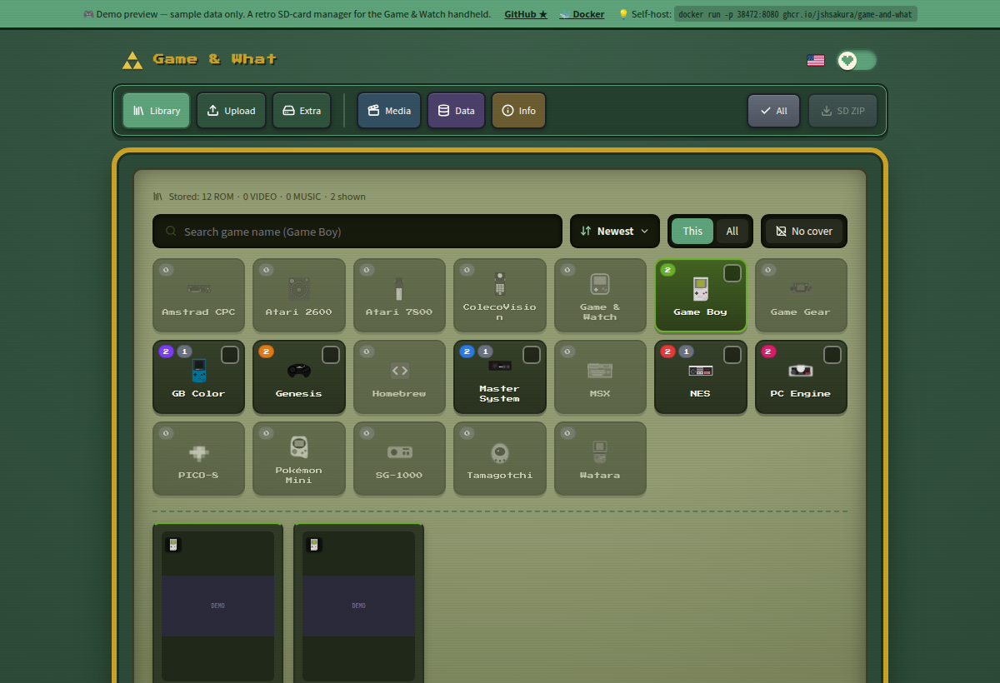

# 🎮 Game & What — 레트로 SD 매니저

[English](README.md) · **한국어**

Game & Watch 휴대기기의 **retro-go-sd** 펌웨어용 SD 카드를 만들어주는 셀프호스트 웹앱입니다.
ROM·영상·음악을 올리면 이름과 기기 규격 커버를 자동으로 붙이고, retro-go SD 카드 레이아웃에
맞춘 단일 ZIP으로 묶어줍니다. SD 카드에 압축만 풀면 끝입니다.

> [retro-go-sd](https://github.com/sylverb/game-and-watch-retro-go-sd) 펌웨어를 타깃으로 합니다.
> 이름 "Game & What"은 말장난이며, 이 프로젝트는 **ROM·BIOS·저작물을 일절 포함하지 않습니다**
> ([면책 조항](#면책-조항) 참조).

**▶︎ [라이브 데모](https://jshsakura.github.io/game-and-what/)** — 샘플 데이터로 보는 정적
미리보기 (백엔드 없음; 업로드·편집은 비활성).


---

## ✨ 기능

- **ROM → 커버.** 지원 시스템의 ROM을 올리면 커버를 자동 검색
  (IGDB → TheGamesDB → libretro-thumbnails)해 기기 규격(**186×100 `.img`**, 비율 유지)으로
  렌더링하고 `/roms/<sys>/이름.<ext>` 옆에 `/covers/<sys>/이름.img`로 저장합니다.
  커버를 직접 검색·업로드·크롭할 수도 있습니다.
- **영상 → `/media`.** 칩의 HW JPEG 디코더가 받는 유일한 형식 — **`.avi` 컨테이너의 MJPEG**
  (320×240, 30fps, 모노) — 으로 `ffmpeg` 재인코딩.
- **음악 → `/music`.** MP3는 그대로 보관(또는 영상에서 추출); 펌웨어 음악 앱이 ID3 태그와
  앨범아트를 직접 읽습니다.
- **원클릭 SD ZIP.** 카드 전체(`/roms`, `/covers`, `/cores`, `/media`, `/music`)를 펌웨어
  레이아웃 그대로 받아 SD 루트에 압축 해제하면 끝.
- **브라우저 플레이.** WASM 코어가 있는 시스템은 페이지 내 에뮬레이션(Nostalgist.js, 실험적).
- **18개 시스템:** NES, 게임보이 / GB 컬러, 게임기어, 마스터시스템, 제네시스, SG-1000,
  PC 엔진, 콜레코비전, MSX, 아타리 2600 / 7800, 암스트라드 CPC, 와타라, 다마고치,
  포켓몬 미니, Game & Watch, 홈브루, PICO-8.
- **11개국어 UI** (ko, en, ja, zh-CN, zh-TW, de, es, fr, it, pt, ru, no) — 로케일별
  CJK/키릴 폰트를 필요할 때 지연 로드.
- **선택형 한국어 모드** (`GNW_KOREAN_MODE=true`) — 한글 자동 명명, "한글패치" 플래그,
  관련 필터. **기본 비활성**(국제판 이미지).
- 레트로 **픽셀아트 UI**, Zelda ↔ Mario 에디션 토글.

## 💾 BIOS / 시스템 롬

일부 기종은 저작권 있는 BIOS가 필요해 기본 제공하지 않습니다. 아래 정확한
**SD 경로**로 **추가파일** 탭에 각 파일을 올리세요(정보 탭에도 목록이 있고,
클릭하면 경로가 복사됩니다). 그러면 그 경로 그대로 SD ZIP에 담기고, **실기
펌웨어와 브라우저 플레이어 모두** 여기서 읽어 옵니다. BIOS는 직접 준비해야
하며, 아래 용량은 표준 크기입니다.

| 기종 | SD 경로 (업로드 위치) | 용량 | 비고 |
|------|----------------------|------|------|
| 패미컴 디스크 시스템 | `bios/nes/disksys.rom` | 8 KB | `.fds` 디스크 이미지에만 필요, `.nes` 카트리지는 불필요. |
| 콜레코비전 | `bios/coleco/coleco.bin` | 8 KB | 시스템 롬 — 모든 게임에 필요. |
| PC엔진 CD | `bios/pce/syscard3.pce` | 256 KB | 시스템 카드 3.0 — 사실상 모든 CD 게임 구동. |
| 오디세이² / 비디오팩 | `bios/videopac/o2rom.bin` | 1 KB | o2em 코어용 o2rom 시스템 BIOS. |
| 코모도어 64 | `bios/c64/basic.bin`, `bios/c64/kernal.bin`, `bios/c64/chargen.bin` | 8 / 8 / 4 KB | C64 시스템 롬 3종 (© Commodore). |
| 타이거 Game.com | `bios/gamecom/internal.bin`, `bios/gamecom/external.bin` | 4 / 256 KB | 내부 OS + 외부/커널 롬 (© Tiger). |

> 브라우저 코어가 SD 저장명과 다른 파일명을 찾을 수 있는데(예: 콜레코비전 코어는
> 같은 바이트를 `colecovision.rom`으로 요구), 앱이 자동으로 매핑해 줍니다. 원본
> 목록은 [`frontend/src/bios.js`](frontend/src/bios.js)에 있습니다.

## 📸 스크린샷

*([라이브 데모](https://jshsakura.github.io/game-and-what/) — 샘플 데이터)*

| 라이브러리 — 시스템별 그리드·커버·원클릭 SD ZIP | 내장 가이드 & SD 규격 레퍼런스 |
|---|---|
|  |  |

**에디션 선택** — UI 전체가 Zelda(초록)와 Mario(빨강) 테마로 리스킨됩니다:


## 빠른 시작 (Docker)

```bash
docker run -d --name game-and-what \
  -p 38472:8080 \
  -v "$PWD/data:/app/backend/data" \
  ghcr.io/jshsakura/game-and-what:latest
# → http://localhost:38472
```

또는 compose로 (`docker compose up -d`). API 키는 필수가 아닙니다 — 없으면 커버 검색만
제한될 뿐입니다. 전체 배포 가이드·환경변수·퍼블리싱·**접근/보안**은
**[DEPLOY.md](DEPLOY.md)** 참조.

## ⚙️ 설정

**인앱 설정 화면이 없습니다** — 모든 옵션은 환경변수(Docker 관례)입니다. `docker run -e`,
compose `.env`, 또는 로컬 개발용 `backend/.env`로 주입하세요. 기동에 필수 항목은 없습니다.
**[`.env.example`](.env.example)** 과 [DEPLOY.md](DEPLOY.md)의 표 참조.

| 변수 | 용도 |
|---|---|
| `IGDB_CLIENT_ID` / `IGDB_CLIENT_SECRET` | IGDB 커버 검색/자동완성 (선택) |
| `TGDB_API_KEY` | TheGamesDB 커버 검색/자동완성 (선택, 월 할당량) |
| `GNW_KOREAN_MODE` | 한국 특화 기능 (기본 `false`) |
| `GNW_CORS_ORIGINS` | CORS 허용 목록 (기본 `*`) |

## 🔒 보안 — 내장 로그인 없음

이 앱은 **인증이 없습니다**(단일 공유 워크스페이스). **인터넷에 그대로 노출하지 마세요.**
앞단에 Zero Trust 계층(Cloudflare Tunnel + Access, 또는 Tailscale)을 두세요. 자세한 설정은
[DEPLOY.md](DEPLOY.md#access-control--no-login-use-zero-trust) 참조.

## 🛠️ 소스에서 개발

```bash
# 백엔드 — FastAPI :38080
cd backend
python3 -m pip install -r requirements.txt
python3 -m uvicorn app.main:app --host 0.0.0.0 --port 38080

# 프론트엔드 — Vite 개발 서버 :38081 (/api → :38080 프록시)
cd frontend
npm install
npm run dev
# → http://localhost:38081
```

로컬 시크릿은 `backend/.env`에 둡니다 (git 무시, `config.py`가 자동 로드).

## 🧱 기술 스택

- **백엔드:** FastAPI (Python 3.12), SQLite, Pillow, `ffmpeg`.
- **프론트엔드:** React 18 + Vite, lucide-react, Nostalgist.js, Press Start 2P +
  Noto Sans (KR/JP/SC/TC) 폰트.
- **패키징:** 멀티스테이지 Docker (Vite 빌드 → SPA+API를 한 포트로 서빙하는 Python 이미지).
  버전 태그 푸시 시 GitHub Actions가 GHCR에 멀티아치(amd64/arm64) 이미지 발행.

## 🙏 크레딧

- [retro-go-sd](https://github.com/sylverb/game-and-watch-retro-go-sd) (sylverb) —
  이 도구가 타깃하는 펌웨어이자 카드 레이아웃·커버 규격의 출처.
- [retro-go](https://github.com/ducalex/retro-go) (ducalex) — 상위 프로젝트.
- 홈브루 앱에 쓰인 `smw` / `zelda3` 재구현 포트 (snesrev).
- 커버 아트: [IGDB](https://www.igdb.com/), [TheGamesDB](https://thegamesdb.net/),
  [libretro-thumbnails](https://github.com/libretro-thumbnails).

## 면책 조항

이 프로젝트는 **ROM·BIOS·저작물 게임 에셋을 일절 포함하지 않습니다** — 합법적으로 보유한
파일은 사용자가 직접 제공해야 합니다. "Game & Watch", 게임 타이틀 및 관련 표장은 각
권리자의 상표이며, 본 프로젝트는 닌텐도 또는 어떤 권리자와도 **무관**하며 **승인받지
않았습니다**. 법적으로 사용 권한이 있는 콘텐츠에 한해 사용하세요.

## 📜 라이선스

이 프로젝트의 **자체 소스 코드**는 [MIT](LICENSE) © 2026 jshsakura.

추가로 **서드파티 컴포넌트**(`frontend/public/cores/`의 libretro 에뮬레이터 코어, 시스템
아이콘, 폰트)를 번들하며 이들은 **각자의 라이선스**(GPLv2/GPLv3, zlib, 퍼블릭 도메인,
CC BY 4.0)를 유지합니다. 컴포넌트별 전체 목록과 대응 소스 링크는
**[THIRD-PARTY-NOTICES.md](THIRD-PARTY-NOTICES.md)** 참조.

> ⚠️ **배포물 기준 비상업.** 번들된 **Genesis Plus GX** 코어(제네시스/MD, 마스터시스템,
> 게임기어, SG-1000)는 **비상업** 라이선스입니다. 따라서 **조립·배포된 형태의** 본
> 프로젝트는 상업적으로 사용·재배포할 수 없습니다. MIT는 저작자 자체 코드에만 적용됩니다.
